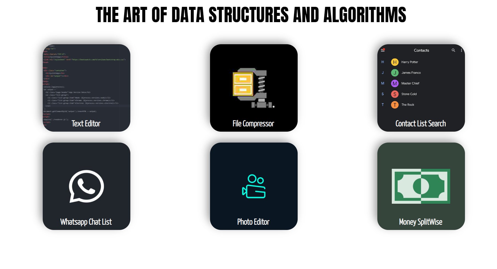
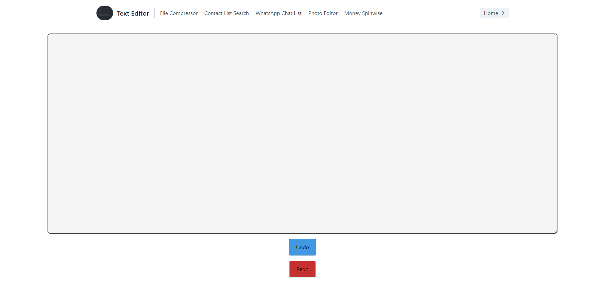
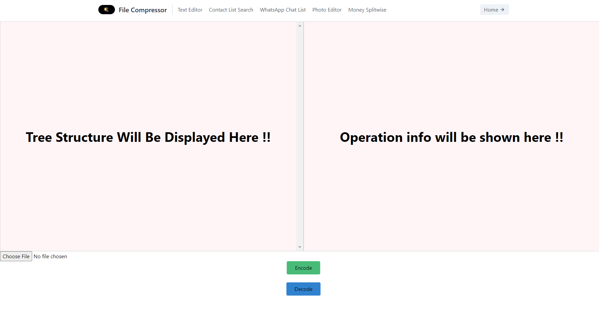
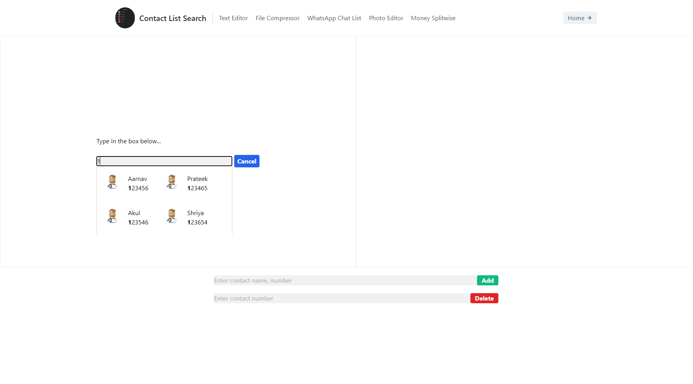
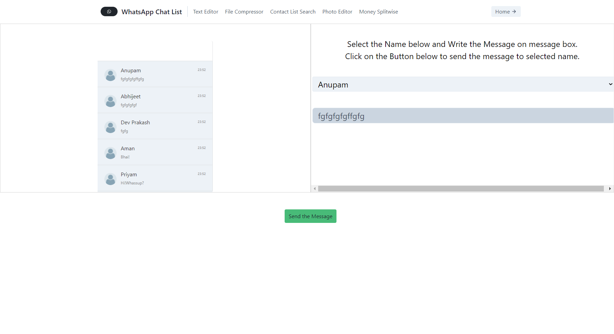
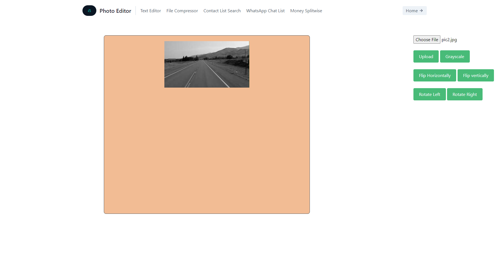
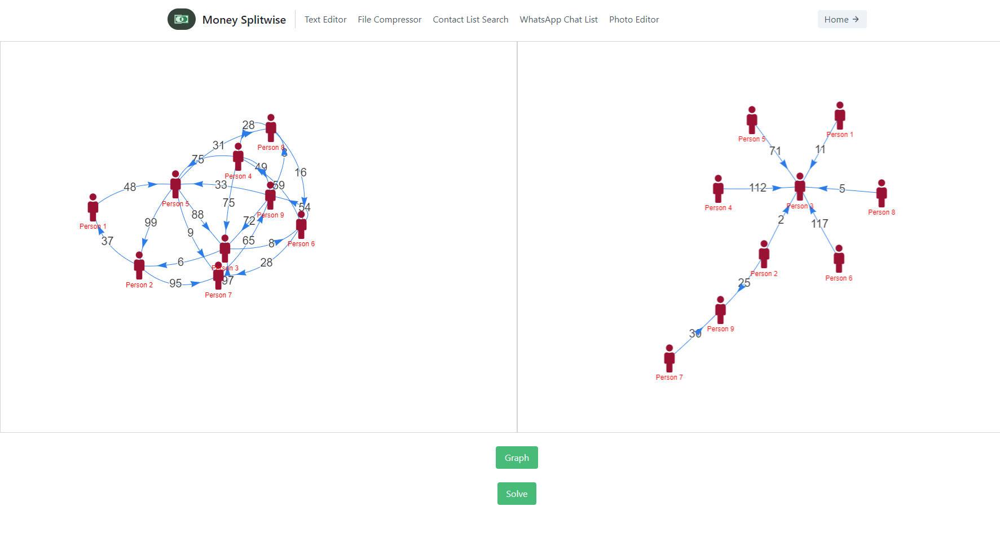

Art Of Data Structures & Algorithms
=====================================

View : https://dsa-real-life-problems.github.io/The-art-of-data-structures-and-algorithms/

What is this all about?
----------------
This project is focused on solving some real-life problems. The project consists of 6 small apps that are implemented using data structures and algorithms. This project has the application of data structures such as heaps,2d arrays, LinkedList, stacks, and algorithms like greedy and graph

Technologies Used
-------
* Html5
* CSS
* Javascript
* Bootstrap
* Vis.js
* Phaser.js

App-1 Text Editor
-------------------

This app consist of Undo and Redo features.A user can undo and redo the text that is written to the editor by the user.This app is made using the Stack Structure. 

App-2 File Compressor
-------------------
This app is used to compress the file uploaded by the user and also user can download the compressed file and can use it. It supports only text file compressing. This app is made by using Huffmann Encoding. 

App-3 Contact List Search
-------------------
This app consist of features like adding contact numbers by a person's name and his number, searching the contact number by typing the some starting letters of name and deleting the contact numbers.This app is made by using the Tries Structure. 

App-4 Whatsapp Chat List
-------------------
This app consist of Whatsapp messaging features in which a user can select the name from the list and write the message to him.This app is made by using the LRU Cache and the Linked list Structure.

App-5 Photo Editor
-------------------
This app consist of Uploading the  Photo, rotating the photo left and right, flipping the photo up and down and changing the color  of pic to grey.This app is made by using 3D Array Concept. 

App-6 Money Splitwise
-------------------
This app tells us how much money a user has to give to other user or has to take from other user.It is made by using Graphs.A User can see a directed graph structure containing how much money a user has to give to other user or user has to take from other user.

https://dsa-real-life-problems.github.io/The-art-of-data-structures-and-algorithms/
